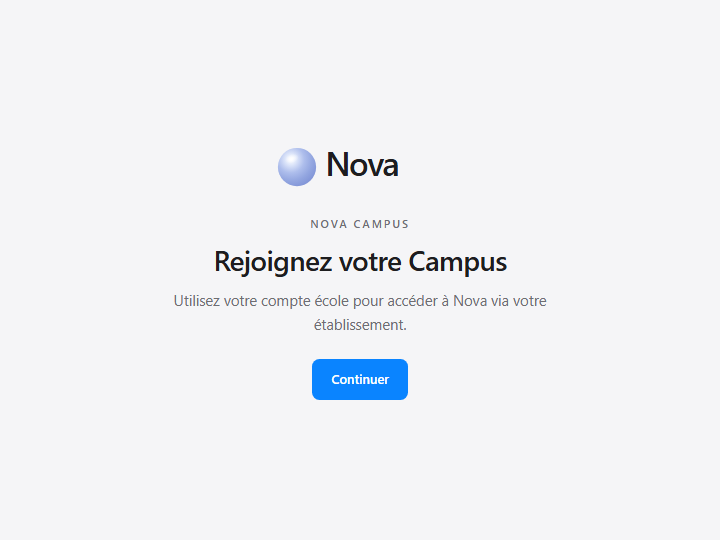
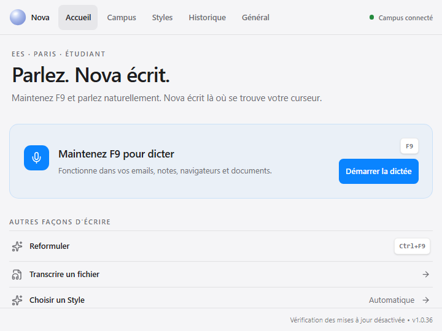
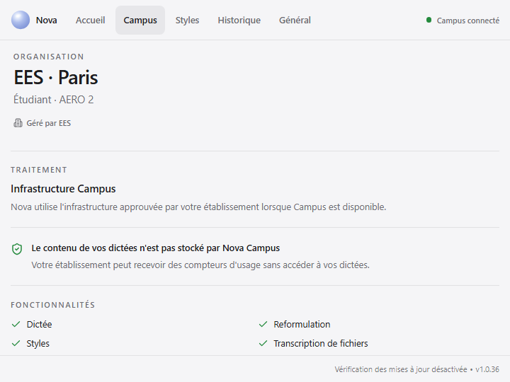
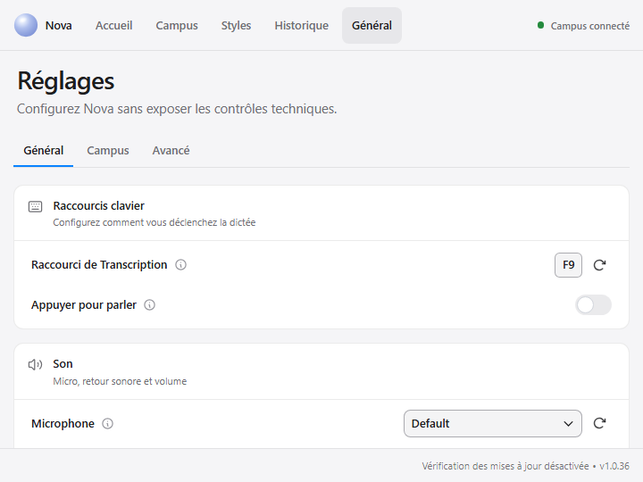
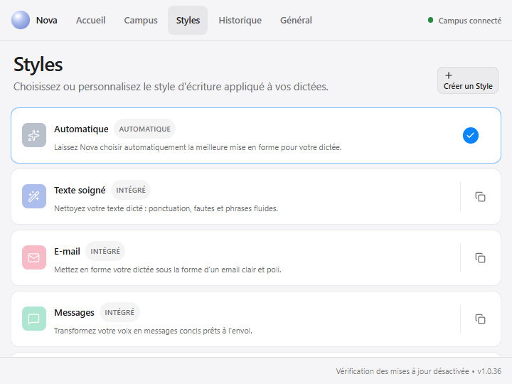

# Nova Campus 1.0 audit

Audit performed against `nova-desktop/campus` (PR #96) and the production branch
`nova-server/master` on 2026-08-16.

## Baseline

The Campus branch already had a working Tauri/Rust network path, OTP sign-in,
Campus transcription and rewrite, local fallback, 401 handling, local Styles,
History, file transcription, settings, i18n, and separate Campus/Personal builds.
Those paths were retained.

The main issues found during the audit were:

- the bearer token was persisted in plaintext in `campus_session.json`, returned
  to JavaScript, and passed back to every authenticated command;
- the Home screen gave Cancel the same visual priority as dictation and used
  multiple nested cards;
- status was repeated on Home, in a floating bubble, and in the footer;
- a floating gear hid the main navigation;
- server hostname and URL were exposed in routine student-facing screens;
- dictionary, snippets, formatting rules, and command APIs were presented as
  functional even though the production server does not expose those routes;
- Settings mixed daily controls with logs, data directories, and debug tools;
- an existing Personal onboarding completion flag could let Campus start without
  a Campus session after logout or migration;
- the OTP UI did not support full-code paste or automatic verification.

## Desktop and server compatibility

| Capability                   | Desktop request                                         | `nova-server/master`                          | Status                    |
| ---------------------------- | ------------------------------------------------------- | --------------------------------------------- | ------------------------- |
| Health                       | `GET /api/health`                                       | Same route and response fields                | Compatible                |
| Email code request           | `POST /api/auth/request` with `email`, `machine`        | Same route/body; returns `sent`               | Compatible                |
| Code verification            | `POST /api/auth/verify` with `email`, `code`, `machine` | Same route/body; returns durable token        | Compatible                |
| Profile                      | `GET /api/me` with Bearer auth                          | Same route; returns `email`, `role`, `cohort` | Compatible                |
| Live dictation               | multipart `POST /api/transcribe`, field `file`          | Same route/field; returns `text`              | Compatible                |
| File transcription           | multipart `POST /api/transcribe`, field `file`          | Same route supports uploaded audio            | Compatible                |
| Rewrite                      | `POST /api/reformulate` with `text`, `style_prompt`     | Same route/body; returns `text`               | Compatible                |
| Organization vocabulary      | `GET /api/vocabulary`                                   | No route                                      | Disabled by safe defaults |
| Personal dictionary          | `/api/dictionary*`                                      | No routes                                     | Disabled by safe defaults |
| Document vocabulary analysis | `POST /api/dictionary/analyze`                          | No route                                      | Disabled by safe defaults |
| Voice snippets               | `/api/snippets*`                                        | No routes                                     | Disabled by safe defaults |
| Formatting rules             | `/api/formatting-rules*`                                | No routes                                     | Disabled by safe defaults |
| Command mode                 | `POST /api/command`                                     | No route                                      | Disabled by safe defaults |

The unimplemented Desktop clients remain as forward-compatible preparation, but
their UI is capability-gated and off by default. The example IT configuration
keeps every unsupported capability disabled.

## Architecture decisions

- `CampusOrganization`, `CampusCapabilities`, `CampusAuthMethod`, education modes,
  and explicit privacy policy types are resolved centrally in
  `src/lib/campusPolicy.ts`.
- Production-safe defaults expose only routes verified on `nova-server/master`.
- Assessment mode starts with dictation only; institution-provided capabilities
  remain authoritative and no client bypass is provided.
- `engineeringNotes` and `aiSkills` exist only as disabled capability flags.
- A single Zustand Campus store owns configuration, public session metadata,
  organization/profile data, and connection state.
- The floating gear/drawer was replaced with a stable top navigation:
  Home, Campus, Styles, History, Settings.
- The top navigation is the single primary connection indicator. Technical
  endpoint details are disclosed only under Campus/System status or Advanced.

## Security and privacy

- After OTP verification, the token stays in Rust and is written to the native OS
  credential store (Windows Credential Manager, macOS Keychain, Linux Secret
  Service).
- The Tauri store retains only non-secret server and email metadata.
- Existing plaintext Campus sessions are migrated once and rewritten without the
  token.
- Authenticated commands load the token inside Rust; JavaScript no longer accepts,
  stores, logs, or sends bearer tokens.
- Logout removes both the native credential and local session metadata.
- A server 401 removes the local credential and returns to Campus onboarding.
- Server tokens currently have no expiry. Logout is local only; remote revocation
  requires the existing admin revoke-machines endpoint. A self-service revoke or
  short-lived/refresh-token design is required before broad production rollout.
- The server database stores usage counters and not dictation content. The client
  only shows a no-storage claim when IT configuration marks that policy as
  verified, because downstream inference logging/retention cannot be proven by
  Desktop alone.

## UX decisions

- Home now has one dominant dictation action, three lightweight secondary paths,
  one current Style, and at most three recent entries. Cancel is absent from Home.
- Campus shows organization, processing mode, verified privacy information,
  enabled features, and an opt-in System status disclosure.
- Onboarding hides the server field when IT configuration exists, masks the email,
  accepts a six-digit paste, auto-verifies a complete code, and never shows the
  server URL on the completion screen.
- Settings uses compact General, Writing (capability-gated), Campus, and Advanced
  tabs. Logs, data directory, debug, version, and endpoint are isolated in
  Advanced.
- Styles use compact semantic rows instead of image-heavy dashboard cards and no
  unavailable engineering-specific Styles are fabricated.

## Accessibility review

The redesigned Campus paths were reviewed against the relevant WCAG 2.1 AA
keyboard, focus, labeling, error, and semantic requirements:

- navigation and primary Campus controls have visible focus indicators and a
  minimum 44 px target;
- the navigation exposes the current page and announces connection changes as a
  polite status;
- onboarding inputs have explicit labels, OTP digits expose their position, and
  validation errors use alert semantics;
- the file-transcription dialog has a name and description, traps keyboard focus,
  closes with Escape when safe, and restores focus to its trigger;
- the automated browser suite covers tab order, keyboard activation, focus
  containment, Escape, and focus restoration at 720 × 540.

Manual NVDA/VoiceOver and calibrated color-contrast measurements remain release
checks; they are not claimed as automated coverage.

## Screenshots

| Onboarding                                                   | Home                                             | Campus                                                     |
| ------------------------------------------------------------ | ------------------------------------------------ | ---------------------------------------------------------- |
|  |  |  |

| Settings                                                 | Styles                                               |
| -------------------------------------------------------- | ---------------------------------------------------- |
|  |  |

## Deployment readiness

### Ready for pilot

- Existing Campus transcription/rewrite with local fallback
- Multi-organization IT configuration model
- Central capability policy with safe production defaults
- Secure client credential storage and 401 cleanup
- Simplified Campus navigation, Home, onboarding, Campus, Styles, and Settings

### Needed before IPSA production deployment

- HTTPS and network perimeter configuration
- Production SMTP configuration
- Explicit, audited privacy policy for Whisper/LLM services and their logs
- Expiring/refreshable tokens or a self-service logout/revocation endpoint
- Server-provided organization/capability/policy document with integrity controls
- Manual Windows 125%/150% scaling and assistive-technology validation
- Load, resilience, and GPU concurrency testing on the pilot infrastructure

### Future Campus 1.x

- Entra ID/OIDC implementations behind the prepared auth-method abstraction
- Server-backed dictionary, snippets, formatting rules, and command mode
- Institution-authored Classroom and Assessment policies
- Real Engineering Notes and AI Skills content, enabled only when implemented
