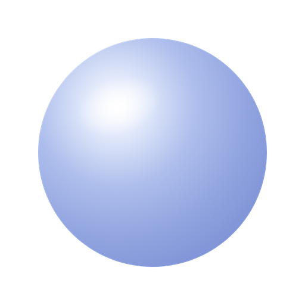
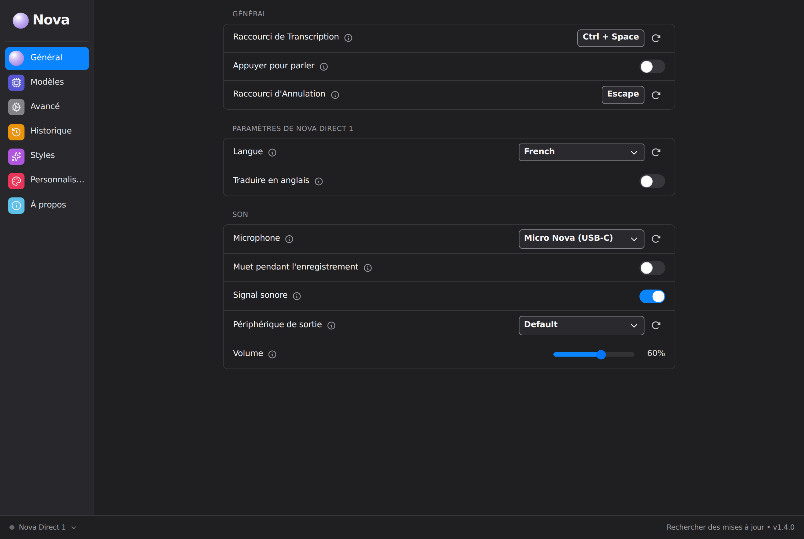
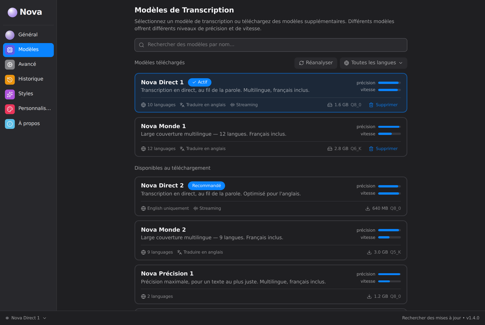
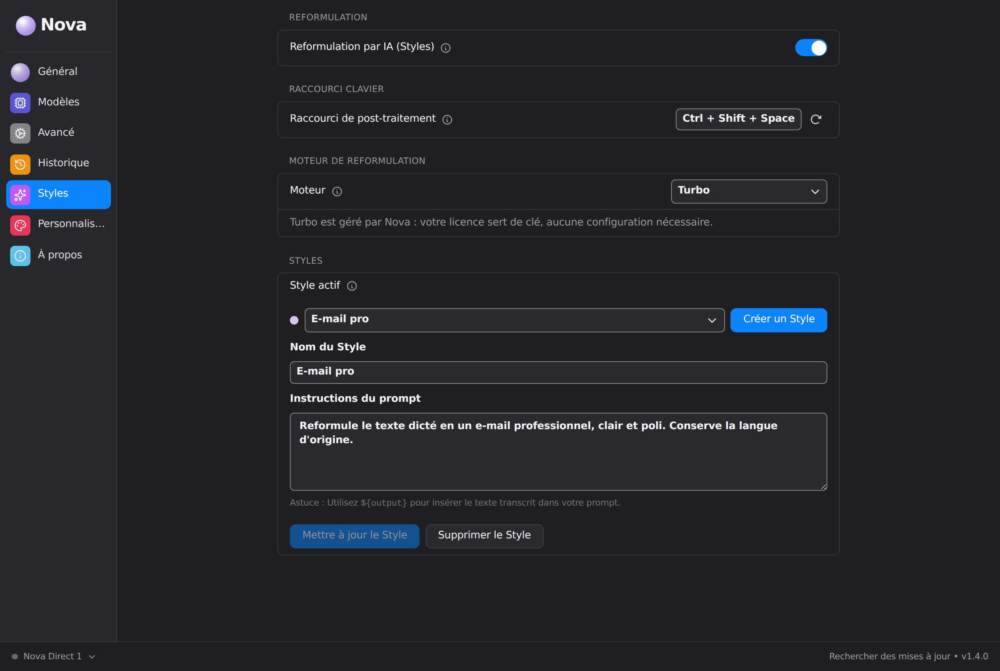
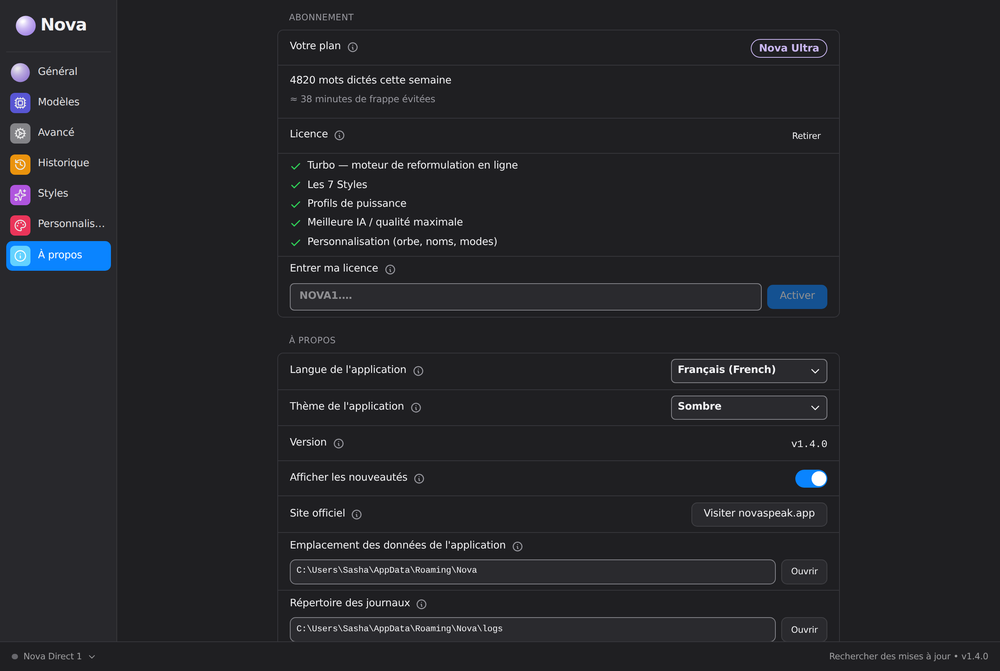

<div align="center">



# Nova

**La dictée vocale qui écrit à votre place — partout, instantanément, en privé.**

Appuyez sur une touche, parlez, et votre texte apparaît dans n'importe quel
champ. Nova transcrit puis, si vous le souhaitez, reformule automatiquement
selon le contexte — e-mail, message, prompt, note, ticket… Le tout sur votre
ordinateur, sans envoyer votre voix sur Internet.

[novaspeak.app](https://novaspeak.app) · Windows

</div>

---

## Sommaire

- [Aperçu](#aperçu)
- [Ce que fait Nova](#ce-que-fait-nova)
- [Comment ça marche](#comment-ça-marche)
- [Les modèles — collection Nova](#les-modèles--collection-nova)
- [Les moteurs d'intelligence](#les-moteurs-dintelligence)
- [Les Styles](#les-styles)
- [Paliers & licence](#paliers--licence)
- [Installation](#installation)
- [Plateformes supportées](#plateformes-supportées)
- [Mises à jour automatiques](#mises-à-jour-automatiques)
- [Confidentialité](#confidentialité)
- [Développement](#développement)
- [Architecture](#architecture)

---

## Aperçu

Nova est une application de bureau qui transforme la parole en texte propre,
directement là où se trouve votre curseur. Contrairement à une simple dictée,
Nova peut **reformuler** ce que vous dites selon l'endroit où vous écrivez :
une phrase jetée à l'oral devient un e-mail soigné, un ticket structuré ou une
liste de tâches — automatiquement.

L'interface suit un langage visuel **Apple / macOS, minimaliste premium** :
barre latérale à catégories, orbe « bille de verre », accent bleu unique.

<div align="center">

</div>

Réglages **Général** : raccourci de dictée, appuyer-pour-parler, langue de
transcription, micro et signal sonore.

---

## Ce que fait Nova

- **Dicter partout** — dans n'importe quelle application : navigateur,
  messagerie, éditeur de code, traitement de texte. Le texte est collé là où
  vous écrivez.
- **Reformuler intelligemment** — chaque dictée peut être réécrite selon un
  **Style** (E-mail, Messages, Prompt IA, To-do list, Prise de notes…) ou
  laissée brute.
- **Détection automatique du Style** — Nova regarde l'application (ou l'onglet)
  au premier plan et choisit le bon Style tout seul. La fenêtre active est lue
  au moment de la dictée puis oubliée — rien n'est conservé.
- **Fonctionner hors ligne** — le moteur **Intelligence privée** transcrit et
  reformule entièrement sur votre machine, sans connexion.
- **Ne jamais laisser le curseur vide** — si la reformulation échoue pour une
  raison quelconque, Nova colle le texte brut. Jamais de perte.
- **Se lancer avec Windows** — Nova est prête dès l'ouverture de session.

---

## Comment ça marche

1. **Maintenez** votre touche de dictée (raccourci configurable) — ou activez
   le mode « appuyer une fois ».
2. **Parlez** pendant que la touche est active. Une bulle discrète confirme que
   Nova vous écoute.
3. **Relâchez.** Nova transcrit votre voix, applique le Style choisi (ou le
   détecte), puis **colle** le résultat dans le champ actif.

Le silence est filtré automatiquement (détection d'activité vocale), de sorte
que seul ce que vous dites réellement est transcrit.

---

## Les modèles — collection Nova

Nova réunit une large **collection de modèles de transcription**, rebrandés en
une gamme signature et classés par catégorie et par rang de qualité :
**Nova Direct** (transcription au fil de la parole), **Nova Monde** (large
couverture multilingue), **Nova Précision** (le texte au plus juste), et des
spécialistes par langue. Chaque modèle affiche sa **précision** et sa
**vitesse**, ses langues et sa taille — sans jamais exposer de nom technique.

<div align="center">

</div>

Le catalogue s'adapte tout seul : un modèle ajouté est automatiquement nommé et
classé selon ses caractéristiques.

---

## Les moteurs d'intelligence

Nova propose deux moteurs, choisis dans les réglages :

| Moteur                  | Description                                                                                          |
| ----------------------- | ---------------------------------------------------------------------------------------------------- |
| **Intelligence privée** | Transcription et reformulation **100 % locales**, hors ligne. Rien ne quitte votre ordinateur.       |
| **Turbo**               | La vitesse maximale, via le réseau. Géré par Nova : votre licence sert de clé, aucune configuration. |

Trois **profils de puissance** ajustent la qualité selon votre machine —
**Nova Air** (léger et vif), **Nova Aura** (le meilleur équilibre) et
**Nova Apex** (l'intelligence maximale). Les profils trop lourds pour la
machine sont automatiquement verrouillés.

---

## Les Styles

Un **Style** est une façon de reformuler votre dictée. Nova est livrée avec des
Styles prêts à l'emploi (E-mail, Messages, Prompt IA, To-do list, Prise de
notes…) et vous pouvez créer les vôtres : un nom, des mots-clés
d'application/onglet, et une consigne de reformulation.

<div align="center">

</div>

Quand l'application ou l'onglet actif contient l'un de vos mots-clés, votre
consigne prend le relais — sans que vous ayez à choisir.

---

## Paliers & licence

<div align="center">

</div>

| Palier         | Inclus                                                                                                                                  |
| -------------- | --------------------------------------------------------------------------------------------------------------------------------------- |
| **Gratuit**    | Dictée locale illimitée · Styles E-mail, To-do list et Prompt IA · quota hebdomadaire de reformulation                                  |
| **Nova Pro**   | Reformulation sans limite · tous les Styles · moteur Turbo                                                                              |
| **Nova Ultra** | Création et modification de Styles sur mesure · profil de puissance maximal · détection automatique avancée · personnalisation complète |

L'abonnement est géré en ligne ; votre licence (`NOVA1.…`) débloque les
fonctions correspondantes directement dans l'application. L'écran d'abonnement
affiche aussi une **statistique de valeur** : mots dictés et minutes de frappe
économisées sur la semaine.

---

## Installation

1. Téléchargez la dernière version depuis **[novaspeak.app](https://novaspeak.app)**.
2. Lancez l'installateur `Nova-Setup.exe`.
3. Accordez à Nova l'accès au micro au premier lancement.
4. Choisissez votre touche de dictée dans les réglages, et commencez.

---

## Plateformes supportées

| Plateforme     | État                                                        |
| -------------- | ----------------------------------------------------------- |
| Windows x86_64 | **Supportée** — plateforme de publication                   |
| Windows arm64  | Compilée en intégration continue                            |
| Linux x86_64   | Compilée en intégration continue (`deb`, `AppImage`, `rpm`) |
| Linux arm64    | Compilée en intégration continue (`deb`, `AppImage`, `rpm`) |
| **macOS**      | **Hors périmètre pour l'instant**                           |

### macOS

Nova ne publie pas de version macOS, et n'en a jamais publié. Distribuer une
application macOS suppose de la **signer et de la faire notariser** par Apple,
donc de disposer d'un compte Apple Developer et d'un certificat Developer ID —
ce que le projet n'a pas mis en place.

Les cibles macOS ont donc été retirées de la matrice de
`.github/workflows/main-build.yml` : elles y échouaient à chaque exécution, à
l'étape d'import du certificat, et rendaient ce workflow rouge en permanence —
au point de masquer les régressions qu'il est censé attraper.

Le support macOS reste **entier dans `build.yml`** : rien n'y a été supprimé.
Rétablir la plateforme demande deux gestes, dans cet ordre :

1. renseigner `APPLE_CERTIFICATE`, `APPLE_CERTIFICATE_PASSWORD` et
   `KEYCHAIN_PASSWORD` dans les secrets du dépôt ;
2. réajouter les deux entrées `macos-26` et `macos-latest` à la matrice de
   `main-build.yml`.

L'historique de la décision, les mesures qui l'ont motivée et le détail
technique sont dans
[l'issue #109](https://github.com/Mailpro31/nova-desktop/issues/109).

---

## Mises à jour automatiques

Nova se met à jour toute seule. À chaque nouvelle version publiée, l'application
détecte la nouveauté (via l'endpoint updater) et propose l'installation en un
clic. Les paquets de mise à jour sont **signés** (minisign) : Nova refuse toute
mise à jour dont la signature ne correspond pas à sa clé publique intégrée —
impossible de lui pousser un binaire falsifié.

La chaîne de publication (compilation Windows, signature, `latest.json`) est
entièrement automatisée par GitHub Actions (`.github/workflows/nova-release.yml`).

---

## Confidentialité

- Avec le moteur **Intelligence privée**, votre voix et vos textes **ne
  quittent jamais** votre ordinateur.
- La fenêtre active, utilisée pour la détection automatique du Style, est lue au
  moment de la dictée puis immédiatement oubliée. Les applications sensibles
  (banque, gestionnaires de mots de passe) sont exclues par défaut et vous
  pouvez en ajouter.
- Aucun enregistrement audio n'est conservé après transcription.

### Latence sur les PC sans GPU

Le profil **Nova Air** utilise un modèle local Qwen 0,5B quantifié et un contexte
réduit pour les machines de 8 Go. Avant la reformulation, Nova applique déjà ses
règles locales de nettoyage (hésitations, répétitions et espaces). La génération
Air est limitée à 1,5 seconde : si elle ne termine pas, le texte nettoyé est collé
immédiatement. Les instructions de Style restent dans un préfixe stable afin que
`llama-server` puisse réutiliser son cache entre deux dictées.

---

## Développement

Nova est une application [Tauri 2](https://tauri.app) : interface **React +
TypeScript** (Vite), cœur natif **Rust**.

### Prérequis

- [Bun](https://bun.sh)
- [Rust](https://rustup.rs) (stable)
- Les dépendances système Tauri pour votre plateforme (voir [BUILD.md](BUILD.md)).

### Commandes

```bash
bun install          # installer les dépendances front
bun run dev          # lancer l'app en développement (Tauri + Vite)
bun run build        # build du front
bun tauri build      # produire l'installateur de bureau
```

### Qualité

```bash
bun run check:translations   # toutes les langues couvrent les clés de l'anglais
bun run lint                 # eslint (dont i18next/no-literal-string)
bun run format:check         # prettier + cargo fmt --check
```

---

## Architecture

```
src/                  Interface React (dock, bulle, réglages, onboarding)
  components/          Composants UI (Apple/macOS, minimaliste premium)
  stores/              État applicatif (modèles, styles, licence…)
  lib/                 Logique front (branding des moteurs, utilitaires)
  i18n/                Traductions (français par défaut, 20+ langues)
src-tauri/            Cœur natif Rust
  src/                 Transcription, reformulation, raccourcis, overlay,
                       licence, quota, empreinte machine
  tauri.conf.json      Configuration Tauri (updater, bundle, identité Nova)
.github/workflows/    CI (qualité de code) + release Windows signée
```

Le langage visuel — orbe « bille de verre », barre latérale à catégories,
interrupteurs macOS, accent bleu Apple unique — est décrit dans
[`CLAUDE.md`](CLAUDE.md) et s'applique à toute nouvelle surface.

---

<div align="center">
<sub>Nova — dictez, Nova écrit.</sub>
</div>
